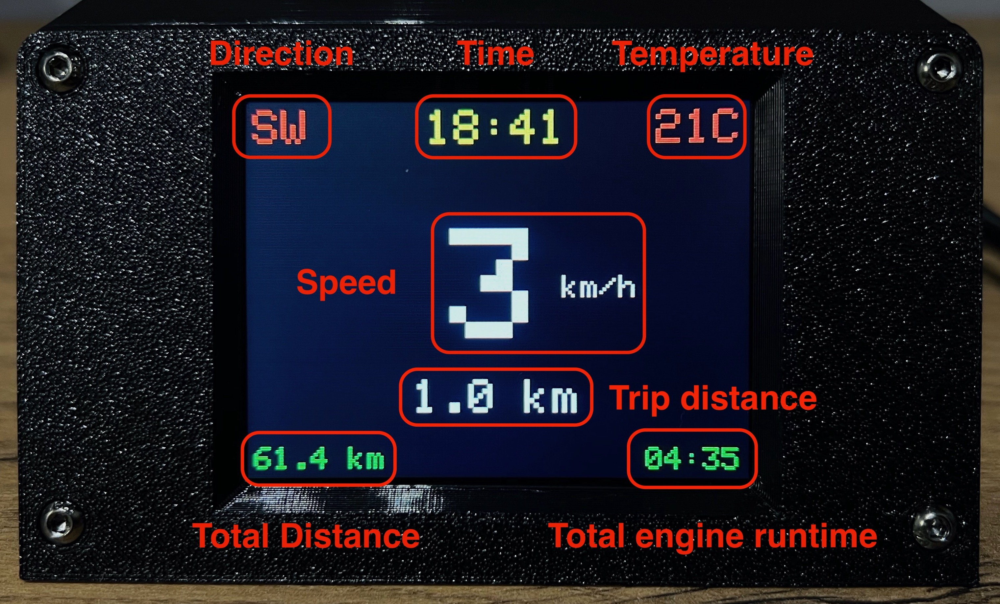

# GPS Marine Trip Computer 🚤

This project is a fully functional GPS Marine Trip Computer designed for boats or other purposes. It displays real-time speed, direction, temperature, time, total odometer reading, total engine operating hours, and trip distance on an ILI9341 TFT display.

## Features
* **Speed Monitoring**: Real-time speed display in km/h.
* **Trip and Total Odometers**: Track current trip distance and total traveled distance.
* **Runtime Tracker**: Records and displays the total runtime of the engine.
* **Temperature Display**: Real-time water or ambient temperature measurement using a DS18B20 sensor.
* **GPS Data**: Displays location-based data, including time (with timezone adjustment) and heading direction.
* **EEPROM Data Persistence**: Saves total distance and runtime data to EEPROM for retrieval after a power cycle.
* **3D Printable Case**: Includes 3D files for printing a custom case and lid.

## Hardware Requirements
* **Micrcontroller**: ESP32 WROOM 30 pins
* **Display**: ILI9341 TFT 2.8inch 240x320
* **GPS Module**: NEO-6M
* **Temperature Sensor**: DS18B20
* **4.7 kΩ pull-up resistor**
* **PCB breadboard**: 60x40mm
* **LC filter (inductor-capacitor filter)**: 0-50V, 2A
* **DC-DC converter**: MP1584 (Input: 4.5-28V, Output: set 3.3/5.0V, 2A)
* **Other Components**: AWG wires, power source, connectors, screws

## Libraries Used
* `Arduino.h` - Core Arduino functionality.
* `Adafruit_GFX` - Graphs library for the TFT display.
* `Adafruit_ILI9341` - ILI9341 display driver library.
* `TinyGPS++` - GPS data parsing library.
* `SoftwareSerial` - Serial communation for the GPS module.
* `DallasTemperature` - Temperature sensor library for DS18B20.
* `OneWire` - OneWire protocol library for DS18B20 sensor.
* `EEPROM` - Library to read/write data from/to the EEPROM.

## Hardware Connections

###  Filter
* Connect the **input** of the LC filter to your **power source** (e.g., 12V boat battery).
* The LC filter is **placed before** the DC-DC converter to smooth out power supply noise.
* **Benefits of LC Filtering:**
  * **Filters out high-frequency noise** from the engine.
  * **Prevents voltage spikes** that could damage components.
  * **Improves power stability** for reliable operation.

### DC-DC Converter (MP1584)
1. **Connect the input** (VIN and GND) of the MP1584 to the **output of the LC filter**.
2. Ensure the power source voltage is within **4.5V – 28V**.
3. **Adjust Output Voltage:**
   * Connect a **multimeter** to the output terminals.
   * Turn the **adjustment potentiometer** to set the output voltage to **3.3V**.
   * Verify the voltage **before connecting the ESP32**.
4. Ensure the converter provides at least **500mA (preferably 1A or more)**.

⚠ **Note:** Do not power the ESP32 with **5V** unless using the **5V** pin (some ESP32 modules support both **5V** and **3.3V** inputs).

### Component Wiring

#### 🖥 TFT Display (ILI9341) SPI-connection:
* **MOSI**: ESP32 GPIO 23
* **MISO**: ESP32 GPIO 19
* **SCK**: ESP32 GPIO 18
* **CS**: ESP32 GPIO 5
* **RESET**: ESP32 GPIO 4
* **DC**: ESP32 GPIO 2
* **LED**: DC-DC converter Output `+`
* **VIN**: DC-DC converter Output `+`
* **GND**: DC-DC converter Output `-`

#### 📡 GPS module (Neo-6M):
* **VCC**: DC-DC converter Output `+`
* **GND**: DC-DC converter Output `-`
* **RX**: ESP32 GPIO 17 (TX2)
* **TX**: ESP32 GPIO 16 (RX2)

#### 🌡 Temperature sensor (DS18B20):
* **VCC**: DC-DC converter Output `+`
* **GND**: DC-DC converter Output `-`
* **Data**: ESP32 GPIO 15

⚠ **Note**: A **4.7kΩ pull-up resistor** is required between Data and VCC.

## How It Works
* **GPS Module**: Continuously streams data (speed, direction, time), processed using `TinyGPS++`.
* **Temperature Sensor (DS18B20)**: Measures water/ambient temperature, updated every second.
* **Display Updates**: Data is shown on the **ILI9341 TFT display**.
* **Logging**: Distance traveled and engine runtime are logged in EEPROM to persist after power cycles.
* **Effient Data Updates**: Display refreshes only on signifant data changes to optimize performance.

## Setup and Installation
1. **Install Libraries**: Install required libraries in Arduino IDE.
2. **Connect Components**: Follow the wiring diagram.
3. **Upload Code**: Flash the provided code onto the ESP32.
4. **GPS Module**: Ensure a **clear view of the sky** for accurate tracking.
5. **Power On**: Start tracking speed, temperature, and trip data!

## 3D Printable Case
This project includes **3D files for printing** a custom case and lid for protection and easy mounting.

## Future Improvements
* **External Storage**: Add SD card support to log trip data.
* **Mobile Connectivity**: Integrate **Bluetooth or Wi-Fi** for app-based tracking.
* **Additional Metrs**: Implement altitude tracking and course history.

## Author
**Igor Kolesnykov**
